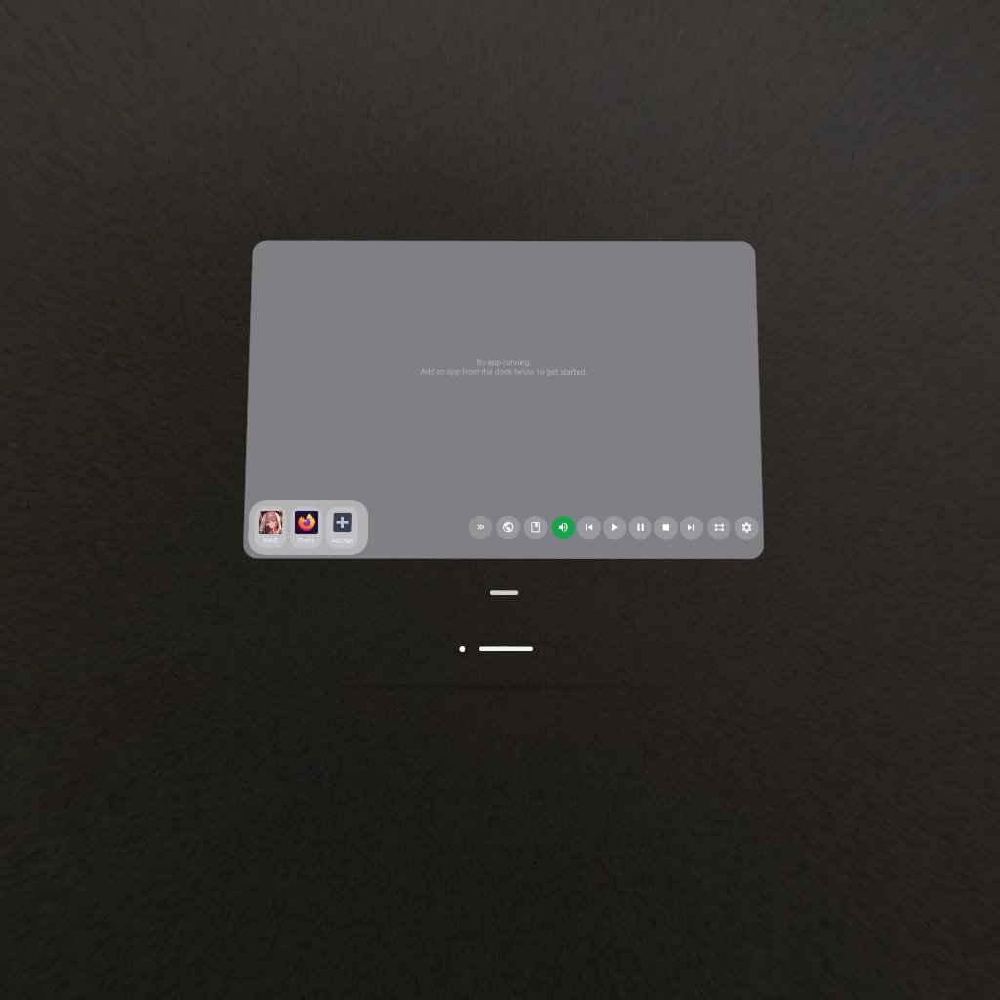

# Spatial Launcher

Private Meta Quest app: cast 2D apps into a spatial panel with optional **3D depth**, **OCR→TTS**, **Listen** (speech→translate→speak), **browser translate**, and **EPUB / My Books** (PC import from Novel Translator).

**Private repo:** https://github.com/saogalaxy/SpatialLauncher

## Preview



More shots will land in [docs/screenshots/](docs/screenshots/) as the VR capture set is exported. Shoot order: [docs/SCREENSHOTS.md](docs/SCREENSHOTS.md)

## Quick install (Quest)

1. Enable **Developer Mode** on the Quest  
2. Plug in USB (or Wi‑Fi ADB) and accept debugging  
3. Prefer **`git clone`** this private repo (not only the ZIP) so Gradle wrapper + assets stay intact  
4. Double-click **`Install to Quest.bat`**

That runs `tools/easy_install.ps1`: checks JDK + Node/metavr + headset, builds the debug APK if needed, installs with replace + permissions, and launches the app.

```powershell
powershell -NoProfile -ExecutionPolicy Bypass -File .\tools\easy_install.ps1
```

See [tools/README.md](tools/README.md).

## Docs

| Doc | What |
|-----|------|
| [docs/HELP.md](docs/HELP.md) | Same guide as the in-headset **?** Help (modes, downloads, combos) |
| [docs/SCREENSHOTS.md](docs/SCREENSHOTS.md) | Store / GitHub screenshot shoot order |
| [docs/screenshots/](docs/screenshots/) | Image drop folder |

## What it does

- **Dock cast** — mirror an app window; leave the source app open  
- **3D** — stereo depth (glasses on / “3D” off)  
- **OCR zones + TTS** — read on-screen dialogue (continuous blue loop)  
- **Listen** — cast audio → SenseVoice → ML Kit → Piper (best with pause breaks)  
- **Browser** — Widevine WebView; on-device Translate or Google; Read  
- **My Books** — EPUB shelf; PC import over Wi‑Fi; tap book again to close  

## Project layout

```
Install to Quest.bat          # one-click build + sideload
tools/
  easy_install.ps1            # JDK / metavr / Gradle / install / launch
  README.md
  export_launcher_icon.py
docs/
  HELP.md
  SCREENSHOTS.md
  screenshots/                # store & GitHub images
app/
  build.gradle
  src/main/
    AndroidManifest.xml
    java/com/spatiallauncher/app/ui/   # panel UI, cast, TTS, Listen, browser, books
    res/                              # layouts, drawables, help strings
    cpp/                              # OpenXR NativeActivity / layers (legacy hooks)
    assets/                           # bundled models (large; some gitignored)
```

### Important app packages (Java UI)

| Area | Classes (under `app/.../ui/`) |
|------|-------------------------------|
| Main panel | `PanelMainActivity`, `UserSettingsStore`, `PanelAlerts` |
| 3D / cast | `GlesZMeshView`, `DepthEstimator`, mirror / MediaProjection path |
| OCR + TTS | `DialogueTextExtractor`, `ScreenDialogueReader`, `PiperTtsEngine` |
| Listen | `PlaybackListenEngine`, `ListenMtTranslator` |
| Page MT | `PageTranslator`, `OnDeviceTranslator`, `TranslateMtService`, `OfflineModelPack` |
| Books | `EpubLibraryStore`, `BookImportService`, `BookImportHttp` |
| Browser | `WidevineWebViewConfig`, `GoogleWebTranslate`, `QwenPageEngine` |

## Build requirements

- JDK 17+  
- Android SDK (see `app/build.gradle` / AGP)  
- Node 20+ (`npx metavr`)  
- Quest with Developer Mode  

Manual:

```powershell
.\gradlew.bat :app:assembleDebug
npx -y metavr app install .\app\build\outputs\apk\debug\app-debug.apk --replace --grant-permissions
npx -y metavr app launch com.spatiallauncher.app
```

## Notes

- Large model archives under `assets/models/` may be gitignored; local builds unpack/download as needed.  
- First **Listen** / male voice / ZH·KO caption packs need Wi‑Fi once — see [docs/HELP.md](docs/HELP.md).  
- Sandbox experiments stay under `com.spatiallauncher.app.sandbox`.
