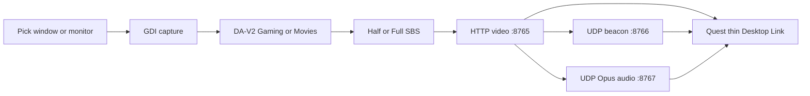

# Spatial Launcher Desktop

PC app that owns **Live 3D depth + OCR/TTS/Listen**, then streams SBS to **Spatial Launcher on Quest** over Wi‑Fi. Quest Desktop Link is a **thin Horizon SBS viewer** (no Quest MiDaS/OCR/Listen while linked).

## Requirements

- Windows 10/11 x64  
- [.NET 8 SDK](https://dotnet.microsoft.com/download/dotnet/8.0) to build  
- Meta Quest on the **same LAN** as the PC  
- Spatial Launcher (Quest) with **Desktop Link**

## Install

Double-click **`Install Spatial Launcher Desktop.bat`** in the repo root, or:

```powershell
powershell -NoProfile -ExecutionPolicy Bypass -File .\tools\desktop_easy_install.ps1
```

App → `%LocalAppData%\SpatialLauncherDesktop\app`  
Models → `%LocalAppData%\SpatialLauncherDesktop\models` (installer fetches DA-V2 Small/Base ONNX when possible)

## Session → Quest (auto-find)



1. PC: **Start Session** (Stream to Quest + Advertise on LAN). Sound defaults to **Headset** (Opus mirror). Minimize to tray OK.  
2. Quest: toolbar **monitor** → auto-find → **Headset 3D on**. Audio starts with the video session.  
3. Paste URL only if discovery fails (firewall / AP isolation).  
4. Allow **TCP 8765**, **UDP 8766** (discovery), **UDP 8767** (audio) on the Windows Firewall LAN profile. PC speakers stay on while Headset mirrors — mute speakers for Quest-only.

### USB link (no Wi-Fi for video)

1. PC: plug in Quest 3 (USB debugging on, authorize the RSA prompt), **Enable USB link**
   in Quest Link settings. The forward is Quest `localhost:8765` → PC **8768**, kept
   off the LAN port 8765 so USB and LAN can run at the same time (needs `adb` —
   PATH, `%LOCALAPPDATA%\Android\Sdk`, `ANDROID_HOME`, or Program Files copy).
2. Quest: Desktop Link chrome → **USB** connects to `http://127.0.0.1:8765/...`
   with the current codec. Reader/speak endpoints ride the same forward.
3. Audio stays on Wi-Fi (Opus is UDP and cannot adb-forward). Without Wi-Fi
   there is no headset audio; video, settings, and reader still work.

The Quest only accepts a saved `localhost` URL while a forward is actually up.
If one is left over from a previous USB session, Desktop Link drops it on launch
and falls back to LAN discovery, so a stale entry cannot strand LAN mode.

Quest button/slider help: [HELP.md](HELP.md) § Desktop Link.

While linked with a live stream: controller **B** toggles PC continuous TTS
on/off, controller **A** speaks one OCR pass of the current frame
(`POST /reader/once`, manual one-shot; continuous stays pipeline-driven).

## PC settings (Spatial Launcher Desktop)

Use **Save** on each section to persist to `%LocalAppData%\SpatialLauncherDesktop\user_settings.json`. Quest can push the same knobs while streaming.

### Profiles

The Session panel has a **Profiles** selector: type a name and **Save profile** to
snapshot all current settings, pick a saved profile to apply it live (mode
chips, engines, and UI follow; the live file tracks the active profile),
**Delete** to remove. Stored in `user_setting_profiles.json` next to the live file.

### Stream

| Control | Default | Notes |
|---------|---------|--------|
| **Gaming / Movies** | Gaming | Gaming = DA-V2 ViT-S ~20 Hz. Movies = DA3 (+ fallbacks), higher depth Hz |
| **JPEG / MPEG / AV1** | JPEG | JPEG sharpest. **AV1** preferred compressed on Quest 3/3S. MPEG = H.264 compatibility |
| **Live 3D** | On | PC depth warp into SBS |
| **Full SBS** | Off | JPEG half-SBS for Spatial Launcher; MPEG/AV1 always render full SBS |
| **Stream width** | 1920 | 1280–2560 capture width |
| **Video / JPEG quality** | 85 | Also maps to H.264/AV1 bitrate (~4–18 Mbps; MPEG gets an extra bump) |
| **Sharpen** | 25 | JPEG only (skipped for MPEG/AV1) |

### Sound

| Control | Default | Notes |
|---------|---------|--------|
| **PC speakers** | — | Local only |
| **Headset** | On | WASAPI loopback → Opus UDP `:8767` to Quest (both play). Stays up across video reconnect; jitter flushes on codec switch |

### 3D look

| Control | Default | Notes |
|---------|---------|--------|
| **3D pop** | 21% | Divergence / how far things stick out |
| **Focus plane** | 50% | Convergence — lower if eyestrain / screen feels close |
| **Depth refresh** | 20 Hz (Gaming) | How often depth updates (Movies preset raises this) |
| **Motion ghosting** | 25% | Temporal depth blend — lower = cleaner moving people |
| **Edge smear clean** | 60% | Higher reduces halos around people |

### Quest Link

| Control | Default | Notes |
|---------|---------|--------|
| **Stream to Quest** | On | Enables TCP `:8765` when session runs |
| **Advertise on LAN** | On | UDP `:8766` beacon for Quest auto-find |
| **Minimize to tray** | On | Session keeps running |
| **Quest Link URL** | read-only | Advertised stream path (`/sbs.mjpg`, `/sbs.h264`, or `/sbs.av1`) |

## Desktop Link — do not regress

Codec / Gaming↔Movies switches and reconnect must stay live. Full invariants: [CHANGELOG.md](../CHANGELOG.md) § *Desktop Link — invariants (do not regress)*.

## Reader on PC

| Mode | Pipeline |
|------|----------|
| Read | PaddleOCR (or Windows OCR) → Piper high |
| Translate | OCR → OPUS-MT ja/zh/ko → Piper |
| Share | OCR → OPUS/as-read → Piper + caption |
| Listen | WASAPI → SenseVoice → OPUS → Piper |

Speech plays on the PC. Quest shows the 3D picture only.

### OCR zones

Empty zones = default lower dialogue band (Quest parity). Toggle **Edit zones**,
drag on the preview to add up to 6 capture-space zones (left eye while
streaming; right-eye drags are ignored since both eyes carry the same frame),
**Clear zones** to reset. Zones apply live to the reader and persist in
`%LocalAppData%\SpatialLauncherDesktop\ocr_zones.json`.

## System tray

Close / minimize keeps capture, depth, stream, discovery, and reader running.

## Privacy

Frames and audio stay on your PC and local Wi‑Fi. See [PRIVACY.md](../docs/PRIVACY.md).
