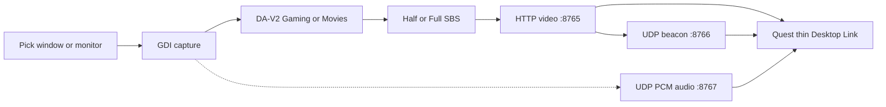

# Spatial Launcher Desktop

PC app that owns **Live 3D depth + OCR/TTS/Listen**, then streams SBS to **Spatial Launcher on Quest** over Wi‑Fi. Quest Desktop Link is a **thin Horizon SBS viewer** (no Quest MiDaS/OCR/Listen while linked).

## Requirements

- Windows 10/11 x64  
- [.NET 8 SDK](https://dotnet.microsoft.com/download/dotnet/8.0) to build  
- Meta Quest on the **same LAN** as the PC  
- Spatial Launcher (Quest) with **Desktop Link**

## Install

Double-click **`Install Spatial Launcher Desktop.bat`** in the repo root, or:

```powershell
powershell -NoProfile -ExecutionPolicy Bypass -File .\tools\desktop_easy_install.ps1
```

App → `%LocalAppData%\SpatialLauncherDesktop\app`  
Models → `%LocalAppData%\SpatialLauncherDesktop\models` (installer fetches DA-V2 Small/Base ONNX when possible)

## Session → Quest (auto-find)



1. PC: **Start Session** (Stream to Quest + Advertise on LAN). Minimize to tray OK.  
2. Quest: toolbar **monitor** → auto-find → Connect with **3D on**.  
3. Sound: **Headset** copies Windows speakers to the Quest (both play); **PC speakers** keeps audio on the PC only.  
4. Paste URL only if discovery fails (firewall / AP isolation).

## Depth presets

| Preset | Model | Default |
|--------|--------|---------|
| **Gaming** | Depth Anything V2 ViT-S | ~20 Hz depth + temporal smooth · fast warp |
| **Movies** | Depth Anything 3 Base (+ Small / DA-V2 Base fallback) | higher quality · forward-fill SBS + hole inpaint |

Adjustable: divergence, convergence, depth Hz, temporal smooth, Half/Full SBS.

## Reader on PC

| Mode | Pipeline |
|------|----------|
| Read | PaddleOCR (or Windows OCR) → Piper high |
| Translate | OCR → OPUS-MT ja/zh/ko → Piper |
| Share | OCR → OPUS/as-read → Piper + caption |
| Listen | WASAPI → SenseVoice → OPUS → Piper |

Speech plays on the PC. Quest shows the 3D picture only.

## System tray

Close / minimize keeps capture, depth, stream, discovery, and reader running.

## Privacy

Frames and audio stay on your PC and local Wi‑Fi. See [PRIVACY.md](../docs/PRIVACY.md).
