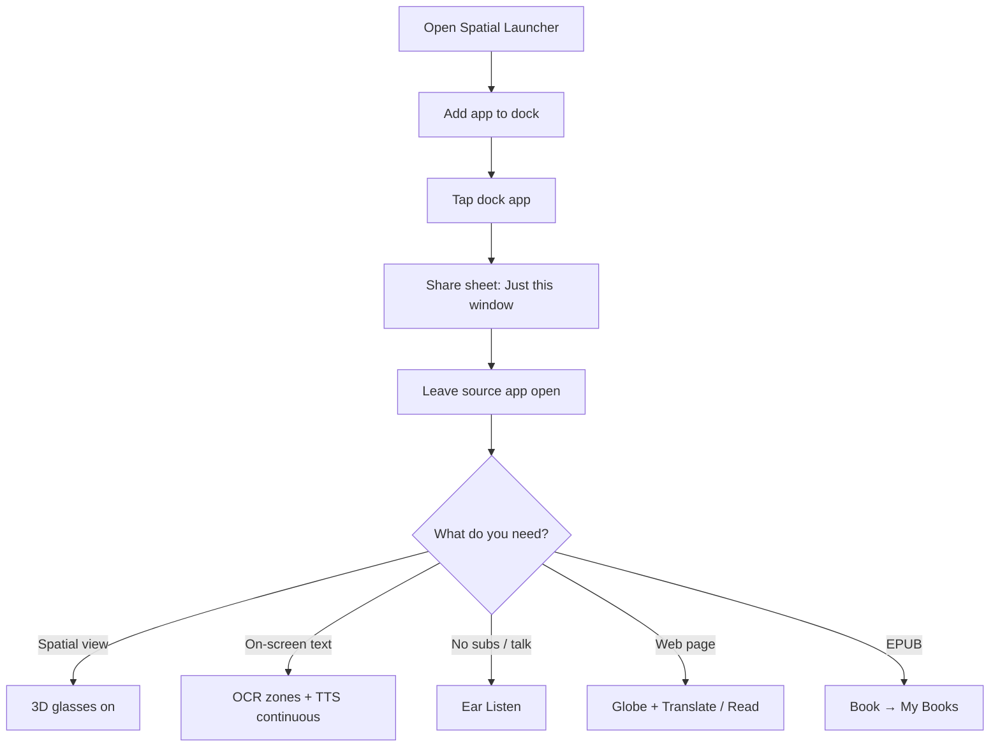
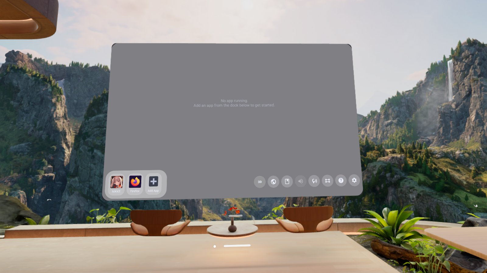
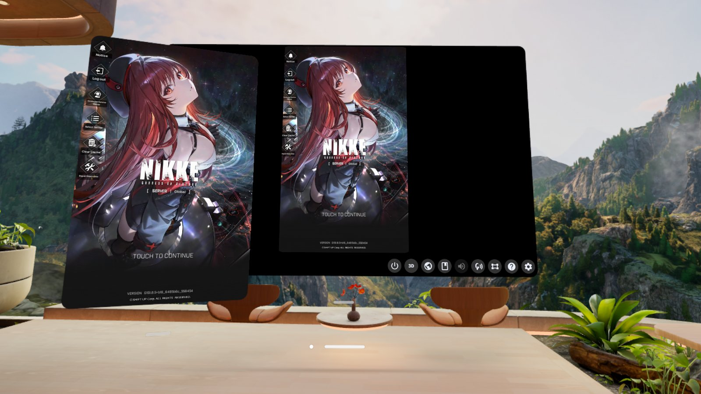
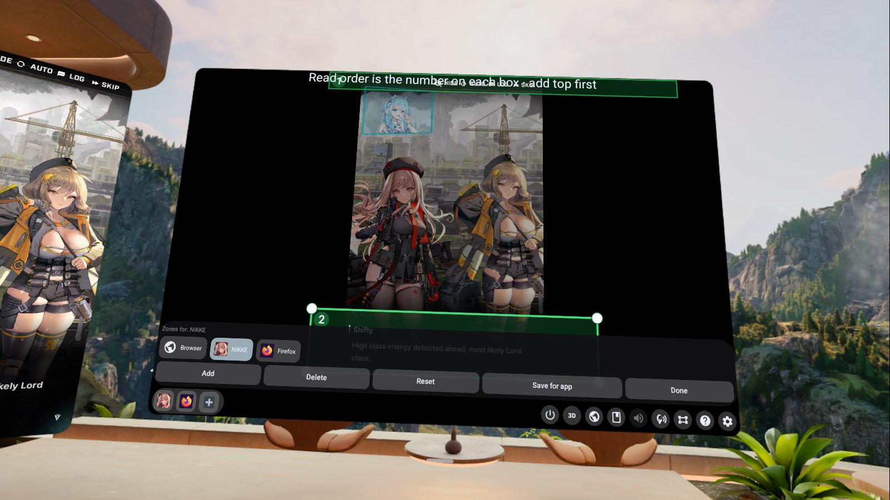
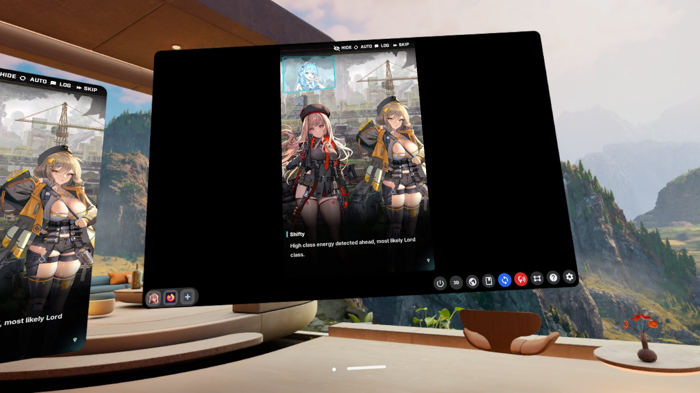
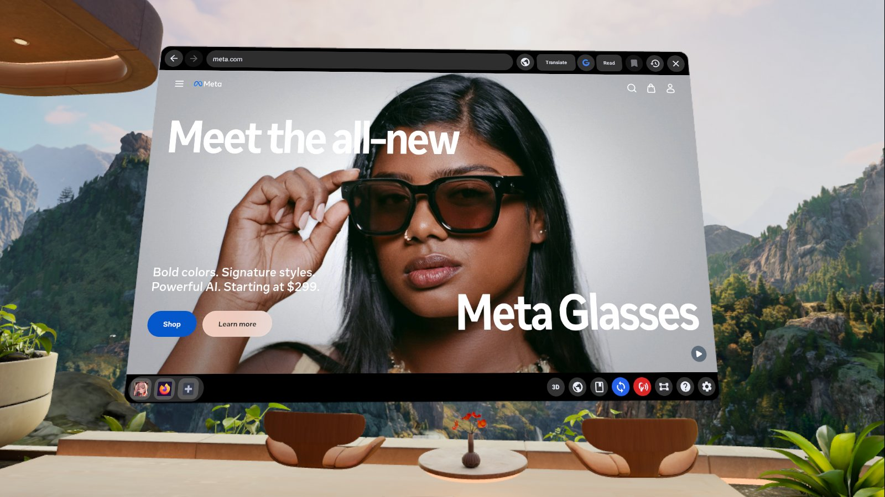

# Meta Horizon Store — listing copy & assets

Working draft for the Developer Dashboard. Source concepts came from the Google Doc  
[Spatial Launcher & Accessibility Suite — Store Description](https://docs.google.com/document/d/13hMtA4r-4YLCaKa1Pzxw10-TVseX43OpU1hwQZC_8v8/edit?usp=sharing),  
updated for the **current** app (Listen, page translate, My Books, 3D glasses, leave-source-open cast).

Screenshots live in [`screenshots/`](screenshots/). Shoot notes: [`SCREENSHOTS.md`](SCREENSHOTS.md).  
Privacy policy for the listing URL: [`PRIVACY.md`](PRIVACY.md). Once the repo is public, use  
`https://github.com/saogalaxy/SpatialLauncher/blob/main/docs/PRIVACY.md` in the Developer Dashboard.

---

## Short description (≤ ~160 chars)

Cast apps in 3D, OCR→TTS dialogue, Listen when there are no subs, translate pages, and read EPUBs — an on-device accessibility suite for Quest.

## Full description (paste into store)

**Spatial Launcher** is a Meta Quest spatial panel for casting Android apps with optional 3D depth, reading on-screen text aloud, listening to spoken dialogue when there are no subtitles, translating web pages, and reading EPUBs — mostly on-device on your headset.

### What you can do

- **Cast an app in 3D** — Pin a game or browser to the dock, pick **Just this window** in the share sheet, leave **3D** on (glasses icon). **Keep the source app’s window open** so the stream stays live.
- **Read on-screen subs / dialogue** — Draw **OCR zones**, save them per app, turn **TTS** on in Settings, use continuous (blue loop) to follow text in the boxes.
- **Listen when there are no subs** — Tap the **ear** (turns red). Cast audio → on-device speech recognition → translate → Piper speech. Best with short pause breaks between lines.
- **Browser translate / read** — Open the **globe**, use on-device **Translate** or optional **Google**, then **Read** with TTS.
- **My Books** — Tap the **book** icon for your EPUB shelf; open a title to read with Prev/Next. Long-press book to import from PC over Wi‑Fi (Novel Translator).

### Why it’s useful

Translate untranslated mobile UIs, follow foreign dialogue, multitask a cast next to Spatial Launcher, and listen to books without leaving VR.

### Notes

- Female + male TTS, SenseVoice, OPUS JA/ZH/KO, page Qwen, and 3D depth ship in the APK (same pack for Meta Store and `easy_install`).  
- See in-headset **?** Help or [`HELP.md`](HELP.md) for combos and dual-mode icons.

---

## User flow (store “how it works”)

### Step-by-step (short)

1. **Dock** — Add App → pin NIKKE / Firefox / etc.  
2. **Cast** — Tap app → select **Just this window** → Share → **leave that app open**.  
3. **3D** — Glasses = on; **“3D”** text = off.  
4. **OCR** — Boxes icon → draw zones → Save for app → Done → Settings → TTS on → continuous.  
5. **Listen** — Ear red (turns TTS continuous + 3D off while active).  
6. **Browser** — Globe → Translate or Google → Read.  
7. **Books** — Book icon → open title; long-press for PC import.

---

## Screenshot map (upload order)

Use these files from `docs/screenshots/`. Meta wants representative in-headset shots (VR environment is fine).

| Order | File | Store role | Caption idea |
|------:|------|------------|--------------|
| 1 | `01-dock-home.jpg` | **Hero** | Floating dock + control row in VR |
| 2 | `01b-share-dialog.jpg` | Teaching | Pick **Just this window** before Share |
| 3 | `02-cast-source-open.jpg` | Highlight: multitask | Source app open + cast in Spatial Launcher |
| 4 | `05-ocr-zones.jpg` | Highlight: OCR | Green zones + per-app chips |
| 5 | `07-listen.jpg` | Highlight: Listen | Ear **red**, cast with dialogue |
| 6 | `08-browser.jpg` | Highlight: browser | Translate / Google / Read chrome |
| 7 | `06-tts-continuous.jpg` | Extra | TTS reading on-screen dialogue |
| 8 | `09-page-translate.jpg` | Extra | Page Translate progress |
| 9 | `10-my-books.jpg` / `10b-book-open.jpg` | Extra | Shelf + reader |
| 10 | `12-ocr-book-reading.jpg` | Extra | Karaoke highlight while reading |
| 11 | `04-settings-depth.jpg` | Extra | Depth / Advanced 3D |
| 12 | `11-help.jpg` | Extra | In-app Help |

**Store minimum (5):** `01` → `02` → `05` → `07` → `08`

### Preview

---

## Feature layout (dashboard sections)

| Section | Visual | Focus |
|---------|--------|--------|
| Hero | `01-dock-home.jpg` | Dock, 3D, control row in space |
| Multitask / cast | `02-cast-source-open.jpg` (+ `01b` if allowed) | Leave source open; side-by-side |
| OCR & TTS | `05-ocr-zones.jpg`, `06-tts-continuous.jpg` | Zones + spoken dialogue |
| Listen | `07-listen.jpg` | No-subs audio path |
| Browser / books | `08`, `09`, `10`, `12` | Translate, Read, EPUB |

---

## Privacy & data safety (dashboard)

- Paste a **public** URL of [`PRIVACY.md`](PRIVACY.md) (GitHub Pages, public gist, or published Google Doc).  
- Honest summary: **on-device by default**; optional Wi‑Fi only for Google Translate button and LAN book import. No Play Store / no first-use model downloads.  
- No developer analytics backend.

---

## Category / keywords (suggestions)

- Accessibility, productivity, utilities  
- Keywords: OCR, TTS, translation, EPUB, spatial, cast, Quest, subtitle, listen  

---

## Checklist before submit

- [ ] Public privacy policy URL matches `docs/PRIVACY.md`  
- [ ] At least 5 screenshots uploaded (`01`, `02`, `05`, `07`, `08`)  
- [ ] Short + full description updated (this file)  
- [ ] Trailer optional  
- [ ] Age rating / content questionnaire filled  
- [ ] Build signed / release channel ready  
