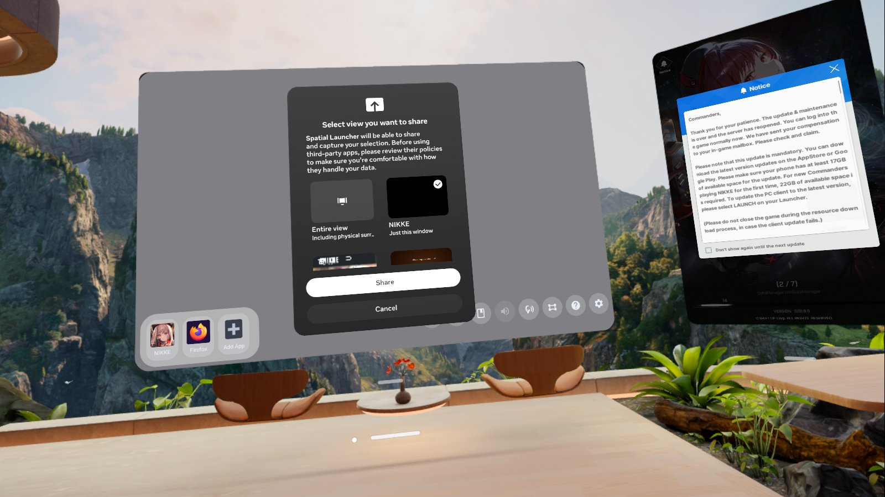
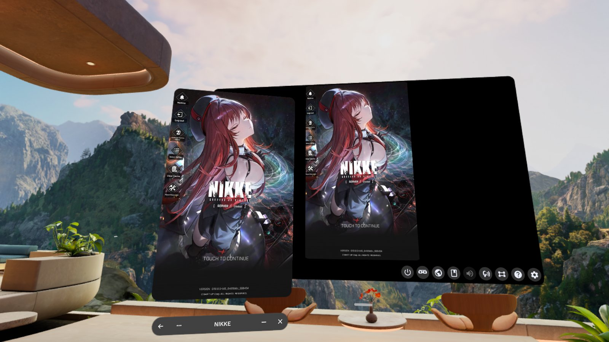
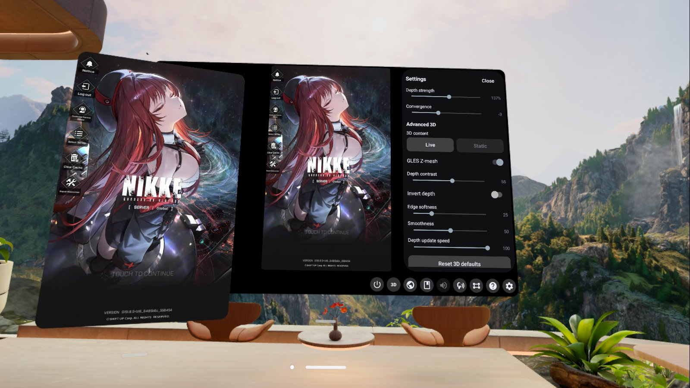
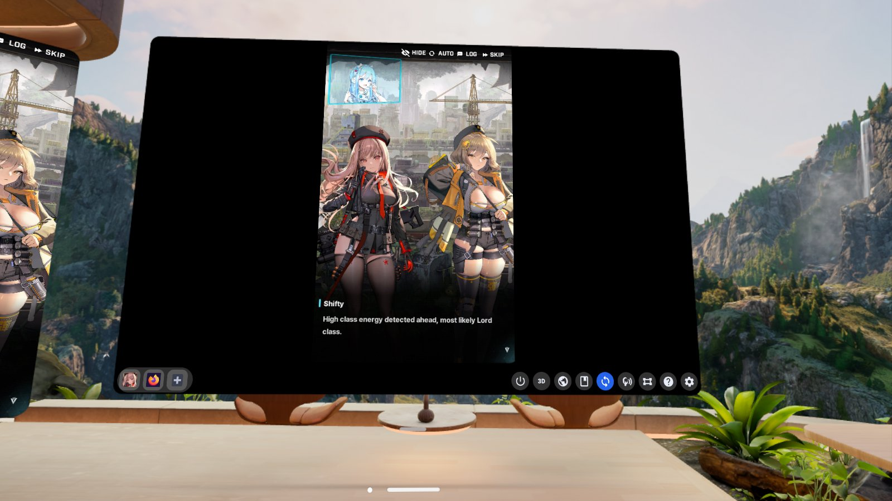
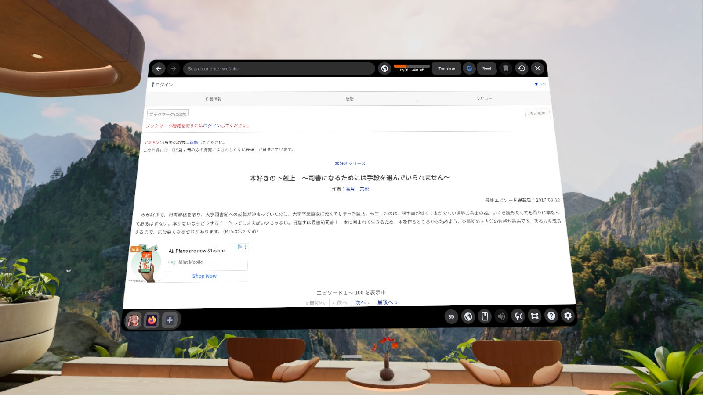
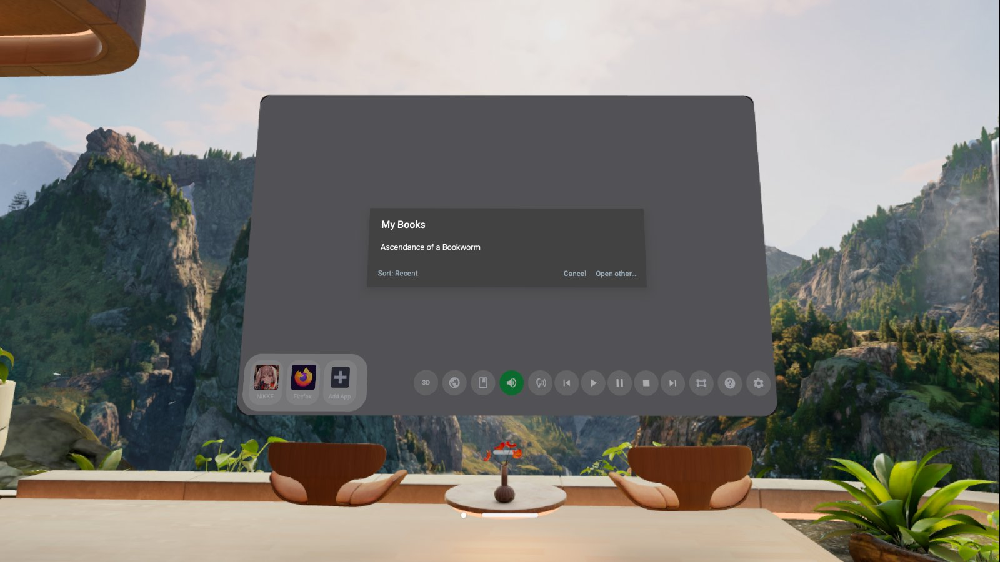
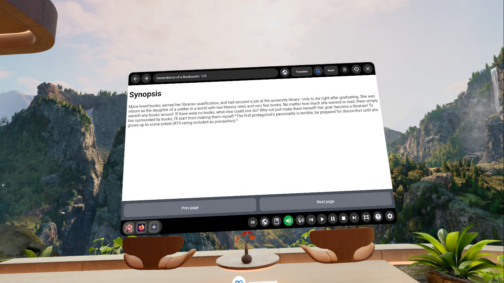
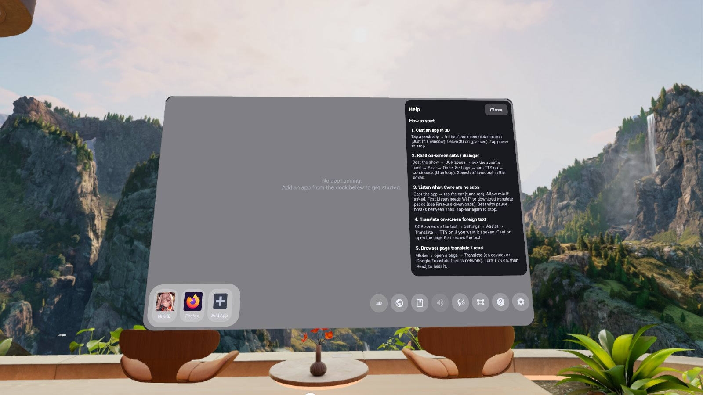
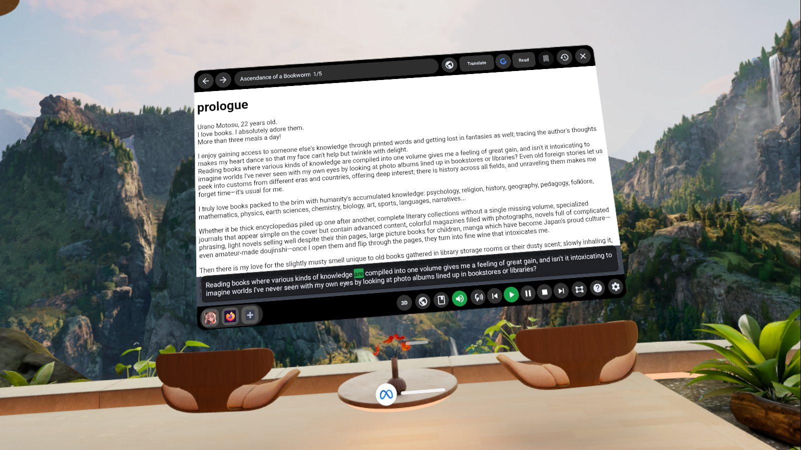

# Screenshots

Store / GitHub images for Spatial Launcher. Pulled from Quest Meta Cam captures in
`/sdcard/Oculus/Screenshots` and mapped to the shoot list in [SCREENSHOTS.md](../SCREENSHOTS.md).

## Gallery

